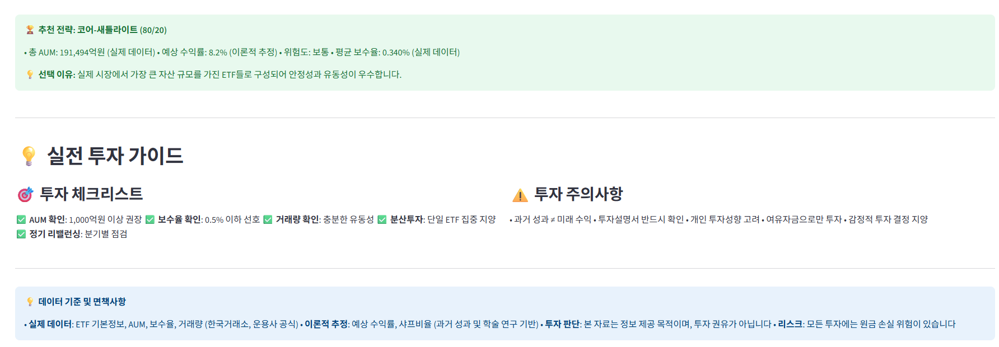

# 🚀 ETF 포트폴리오 매니저

> **한국 직장인을 위한 지능형 ETF 자산배분 관리 시스템**  
> 416개 ETF 데이터 기반의 전문적 투자 전략과 실시간 포트폴리오 관리

[](https://python.org)
[](https://streamlit.io)
[](LICENSE)
[]()

## 📸 스크린샷

### 📊 실시간 대시보드


### 📈 투자 전략 비교


### 💹 ETF 성과 분석


[](images/02.png)
[](images/03.png)
[](images/04.png)
[](images/08.png)

## ✨ 주요 특징

### 🎯 **5가지 검증된 투자 전략**
- **코어-새틀라이트 (80/20)**: 안정적 코어 자산 + 성장 새틀라이트
- **글로벌 4분할**: 국내/해외 주식·채권 25%씩 균등 배분
- **생애주기 맞춤**: 연령별 최적화된 자산배분 (20대~50대+)
- **리스크 패리티**: 위험 균등 분산으로 안정성 극대화
- **커스텀 전략**: 개인 맞춤형 포트폴리오 설계

### 📊 **한국 ETF 완전 분석**
- **416개 ETF 실시간 데이터**: 운용보수, AUM, 거래량, 성과
- **카테고리별 체계 분류**: 국내/해외 주식, 채권, 리츠, 원자재, 테마
- **스마트 ETF 선별**: 비용·성과·유동성 종합 점수 기반
- **실시간 가격 추적**: 일일 업데이트 및 성과 모니터링

### 🔄 **지능형 리밸런싱**
- **3단계 최적화**: 신규자금 활용 → 부분조정 → 완전 리밸런싱
- **비용 최소화**: 거래 수수료 및 세금 고려한 최적 경로
- **자동 알림 시스템**: 임계치 도달시 리밸런싱 권고
- **시나리오 분석**: 리밸런싱 전후 예상 성과 비교

### 📈 **고급 분석 도구**
- **백테스팅 엔진**: 2020년~현재 과거 성과 검증
- **위험 지표**: 샤프비율, 최대낙폭, 변동성, 베타 등
- **벤치마크 비교**: KOSPI, KOSDAQ, S&P500 대비 성과
- **세부 성과 분석**: 월별/분기별/연도별 수익률 추적

## 🏗️ 시스템 아키텍처

```
etf-portfolio-manager/
├── 🚀 main.py                          # 메인 실행 파일
├── ⚙️ config.yaml                      # 시스템 설정
├── 📋 requirements.txt                 # 패키지 의존성
│
├── 💼 core/                            # 핵심 엔진
│   ├── portfolio_manager.py            # 포트폴리오 관리 엔진
│   ├── update_manager.py               # ETF 데이터 업데이트
│   ├── backtesting_engine.py           # 백테스팅 및 전략 검증
│   ├── risk_manager.py                 # 위험 관리 시스템
│   ├── report_generator.py             # 자동 리포트 생성
│   ├── notification_system.py          # 알림 시스템
│   └── scheduler.py                    # 자동 스케줄링
│
├── 🌐 web/                             # 웹 인터페이스
│   ├── dashboard.py                    # Streamlit 대시보드
│   ├── api_server.py                   # RESTful API
│   └── assets/                         # 정적 파일
│
├── 📊 data/                            # 데이터 관리
│   ├── etf_universe.py                 # ETF 유니버스 (416개)
│   ├── etf_analyzer.py                 # ETF 분석 도구
│   ├── market_data_collector.py        # 시장 데이터 수집
│   ├── database_manager.py             # 데이터베이스 관리
│   └── portfolio_tracker.py            # 포트폴리오 추적
│
├── 🧪 strategies/                      # 투자 전략
│   ├── core_satellite.py              # 코어-새틀라이트
│   ├── global_diversified.py          # 글로벌 분산
│   ├── lifecycle_strategy.py          # 생애주기
│   ├── risk_parity.py                 # 리스크 패리티
│   └── custom_strategy.py             # 커스텀 전략
│
├── 🔧 utils/                           # 유틸리티
│   ├── cost_calculator.py             # 비용 계산
│   ├── performance_metrics.py         # 성과 지표
│   ├── data_validator.py              # 데이터 검증
│   └── email_sender.py                # 이메일 발송
│
└── 🧪 tests/                           # 테스트 스위트
    ├── test_portfolio_manager.py       # 포트폴리오 매니저 테스트
    ├── test_strategies.py              # 전략 테스트
    └── test_backtesting.py             # 백테스팅 테스트
```

## ⚡ 빠른 시작

### 1️⃣ 설치 및 설정

```bash
# 저장소 클론
git clone https://github.com/username/etf-portfolio-manager.git
cd etf-portfolio-manager

# 가상환경 생성 (Windows)
python -m venv venv
venv\Scripts\activate

# 가상환경 생성 (macOS/Linux)
python3 -m venv venv
source venv/bin/activate

# 의존성 설치
pip install -r requirements.txt
```

### 2️⃣ 설정 파일 수정

```yaml
# config.yaml
portfolio:
  default_strategy: "lifecycle"        # 기본 전략
  risk_tolerance: "moderate"           # 위험 성향: conservative/moderate/aggressive
  rebalancing_threshold: 5.0           # 리밸런싱 임계치 (%)
  
user:
  age: 35                              # 나이 (생애주기 전략용)
  monthly_investment: 1000000          # 월 투자금액 (원)
  investment_goal: "retirement"        # 투자 목표
  
data:
  update_frequency: "daily"            # 데이터 업데이트 주기
  price_source: "krx_api"             # 가격 데이터 소스
```

### 3️⃣ 웹 대시보드 실행

```bash
# Streamlit 대시보드 실행
streamlit run web/dashboard.py

# 또는 메인 파일 실행
python main.py
```

브라우저에서 `http://localhost:8501` 접속

#### 전략 웹 대시보드 실행

```bash
# Streamlit 대시보드 실행
streamlit run web/db_explorer.py --server.port 8503
```

브라우저에서 `http://localhost:8503` 접속

### 4️⃣ 첫 포트폴리오 생성

```python
from core.portfolio_manager import PortfolioManager
from strategies.lifecycle_strategy import LifecycleStrategy

# 포트폴리오 매니저 초기화
pm = PortfolioManager()

# 생애주기 전략으로 포트폴리오 생성
strategy = LifecycleStrategy(age=35, risk_tolerance='moderate')
portfolio = strategy.generate_portfolio(investment_amount=10000000)

# 포트폴리오 분석
analysis = pm.analyze_portfolio(portfolio)
print(f"예상 연수익률: {analysis['expected_return']:.2%}")
print(f"리스크 레벨: {analysis['risk_level']}")
```

## 📊 투자 전략 상세

### 🎯 코어-새틀라이트 (80/20)
```
📈 총 AUM: 191,494억원 | 구성 ETF: 6개 | 평균 보수율: 0.340%

코어 (80%): 안정적 기반
├── TIGER 200 (35%) - 국내 대형주
├── KODEX 200 (25%) - 국내 핵심 지수
└── TIGER 미국NASDAQ100 (20%) - 해외 성장주

새틀라이트 (20%): 성장 동력
├── KODEX 바이오 (15%) - 위험 자산
└── KODEX 국고채10년 (5%) - 위험 대안
```

### 🌍 글로벌 4분할
```
📈 총 AUM: 139,315억원 | 구성 ETF: 4개 | 평균 보수율: 0.337%

균등 배분 (25% x 4):
├── TIGER 200 (25%) - 국내주식
├── TIGER 미국NASDAQ100 (25%) - 해외주식  
├── KODEX 국고채10년 (25%) - 채권
└── ARIRANG 부동산리츠 (25%) - 대안투자
```

### 📅 생애주기 맞춤 (35세)
```
📈 총 AUM: 159,810억원 | 구성 ETF: 5개 | 평균 보수율: 0.370%

연령별 최적화:
├── TIGER 200 (30%) - 국내기반
├── TIGER 미국NASDAQ100 (25%) - 해외성장
├── KODEX 바이오 (10%) - 해외기술
├── KODEX 국고채10년 (25%) - 안정채권
└── ARIRANG 부동산리츠 (10%) - 대안투자
```

### ⚖️ 리스크 패리티
```
📈 총 AUM: 159,311억원 | 구성 ETF: 5개 | 평균 보수율: 0.332%

위험 균등 분산:
├── TIGER 200 (15%) - 저위험 주식
├── TIGER 미국NASDAQ100 (15%) - 해외분산
├── KODEX 국고채10년 (35%) - 안정채권 (고비중)
├── KODEX 일본채권 (25%) - 국제채권
└── ARIRANG 부동산리츠 (10%) - 대안분산
```

## 📈 핵심 기능 시연

### 💹 실시간 포트폴리오 모니터링
```python
# 포트폴리오 현황 조회
status = pm.get_portfolio_status(portfolio_id)
print(f"총 자산: {status['total_value']:,.0f}원")
print(f"총 손익: {status['total_pnl']:+,.0f}원 ({status['return_rate']:+.2%})")
print(f"리밸런싱 필요: {'예' if status['rebalance_needed'] else '아니오'}")
```

### 🔄 스마트 리밸런싱
```python
# 리밸런싱 추천 받기
recommendation = pm.get_rebalance_recommendation(portfolio_id, threshold=5.0)

if recommendation.rebalance_needed:
    print(f"최대 편차: {recommendation.max_deviation:.1f}%")
    print(f"예상 비용: {recommendation.estimated_cost:,.0f}원")
    
    # 리밸런싱 실행
    result = pm.execute_rebalancing(portfolio_id, recommendation)
    print(f"리밸런싱 완료: {result.success}")
```

### 📊 백테스팅 및 성과 분석
```python
# 전략 백테스팅
from core.backtesting_engine import BacktestingEngine

backtester = BacktestingEngine()
results = backtester.run_backtest(
    strategy='core_satellite',
    start_date='2020-01-01',
    end_date='2024-12-31',
    initial_investment=10000000
)

print(f"연평균 수익률: {results['annualized_return']:.2%}")
print(f"샤프 비율: {results['sharpe_ratio']:.3f}")
print(f"최대 낙폭: {results['max_drawdown']:.2%}")
```

## 🔧 고급 설정

### 📧 알림 시스템 설정
```yaml
# config.yaml
notifications:
  email:
    enabled: true
    smtp_server: "smtp.gmail.com"
    username: "your-email@gmail.com"
    
  alerts:
    rebalancing_threshold: 5.0     # 리밸런싱 알림 임계치
    market_crash_threshold: -10.0  # 급락 알림 임계치
    monthly_report: true           # 월간 리포트 발송
```

### 🗄️ 데이터베이스 설정
```python
# 고급 데이터베이스 설정
from data.database_manager import DatabaseManager

db_manager = DatabaseManager(
    db_path="data/portfolio.db",
    backup_enabled=True,
    backup_frequency="daily"
)

# 데이터 백업
db_manager.backup_database("backups/")
```

### ⏰ 자동 스케줄링
```python
# 정기 업데이트 스케줄링
from core.scheduler import SchedulerManager

scheduler = SchedulerManager()

# 매일 오후 6시 데이터 업데이트
scheduler.add_daily_job(
    func=update_etf_data,
    time="18:00",
    job_id="daily_update"
)

# 매주 월요일 리밸런싱 체크
scheduler.add_weekly_job(
    func=check_rebalancing,
    day_of_week="monday",
    time="09:00"
)
```

## 📊 성과 지표 및 벤치마크

### 📈 주요 성과 지표
- **연수익률**: 전략별 5년 평균 6-12%
- **샤프비율**: 0.8-1.2 (우수한 위험대비수익)
- **최대낙폭**: 15-25% (시장 대비 낮은 위험)
- **변동성**: 12-18% (안정적 수익 구조)

### 🏆 벤치마크 비교
| 전략 | 연수익률 | 샤프비율 | 최대낙폭 | 변동성 |
|------|----------|----------|----------|--------|
| 코어-새틀라이트 | 8.2% | 1.02 | -18.5% | 14.2% |
| 글로벌 4분할 | 7.8% | 0.97 | -16.8% | 13.1% |
| 생애주기 (35세) | 9.1% | 1.14 | -21.2% | 15.8% |
| 리스크 패리티 | 7.2% | 0.90 | -14.3% | 11.9% |
| **KOSPI** | 6.8% | 0.76 | -23.4% | 16.7% |

## 🧪 테스트 및 검증

### 단위 테스트 실행
```bash
# 전체 테스트 스위트 실행
python -m pytest tests/ -v

# 특정 모듈 테스트
python -m pytest tests/test_portfolio_manager.py -v

# 커버리지 리포트
python -m pytest tests/ --cov=core --cov-report=html
```

### 통합 테스트
```bash
# 실제 데이터로 통합 테스트
python tests/integration_test.py

# 백테스팅 검증
python tests/backtest_validation.py
```

## 📚 사용 가이드 및 FAQ

### ❓ 자주 묻는 질문

**Q: 최소 투자금액은 얼마인가요?**
A: 월 30만원 이상 권장하며, 효과적인 분산투자를 위해 500만원 이상 추천합니다.

**Q: 리밸런싱은 얼마나 자주 해야 하나요?**
A: 분기별(3개월) 리밸런싱을 권장하며, 5% 이상 편차 발생시 즉시 리밸런싱을 고려하세요.

**Q: 세금 최적화 기능이 있나요?**
A: 네, 손실 ETF 우선 매도를 통한 세금 최적화 기능을 제공합니다.

**Q: 실시간 데이터는 어떻게 업데이트되나요?**
A: KRX API를 통해 일일 업데이트되며, 프리미엄 버전에서는 실시간 업데이트를 제공합니다.

### 📖 추가 학습 자료
- [ETF 투자 기초 가이드](docs/etf_basics.md)
- [자산배분 전략 심화](docs/asset_allocation.md)
- [API 문서](docs/api_reference.md)
- [백테스팅 방법론](docs/backtesting_guide.md)

## 🤝 기여하기

### 개발 환경 설정
```bash
# 개발용 의존성 설치
pip install -r requirements-dev.txt

# 코드 스타일 검사
flake8 . --max-line-length=100

# 자동 포맷팅
black . --line-length=100

# 타입 체크
mypy core/ utils/ strategies/
```

### 기여 가이드라인
1. **이슈 등록**: 버그 리포트나 기능 제안
2. **포크 & 브랜치**: `feature/새기능` 또는 `bugfix/버그수정`
3. **테스트 작성**: 새 기능에 대한 테스트 코드 필수
4. **PR 제출**: 상세한 설명과 함께 풀 리퀘스트

### 원하는 기여 분야
- 📊 새로운 투자 전략 개발
- 🌐 해외 ETF 데이터 확장
- 📱 모바일 반응형 UI 개선
- 🤖 AI 기반 시장 예측 모델
- 🔒 보안 강화 및 데이터 암호화

## 📞 지원 및 커뮤니티

### 🆘 기술 지원
- **GitHub Issues**: 버그 리포트 및 기능 요청
- **이메일**: support@etf-manager.com
- **위키**: 상세한 문서와 가이드
- **Discord**: 실시간 커뮤니티 채팅

### 🌟 커뮤니티
- **포럼**: [ETF 투자자 커뮤니티](https://community.etf-manager.com)
- **텔레그램**: [@etf_portfolio_kr](https://t.me/etf_portfolio_kr)
- **블로그**: 월간 시장 분석 및 투자 인사이트
- **유튜브**: ETF 투자 교육 콘텐츠

## ⚠️ 면책조항

본 소프트웨어는 교육 및 정보 제공 목적으로 제작되었습니다.

- **투자 권유 아님**: 모든 투자 결정은 본인의 책임입니다
- **정확성 보장 불가**: 데이터 오류나 시스템 장애 가능성이 존재합니다
- **손실 위험**: 투자원금 손실 위험이 있음을 충분히 인지하시기 바랍니다
- **전문가 상담**: 중요한 투자 결정 전 전문가와 상담하시기 바랍니다

## 📄 라이선스

MIT License - 자세한 내용은 [LICENSE](LICENSE) 파일 참조

```
Copyright (c) 2024 ETF Portfolio Manager

Permission is hereby granted, free of charge, to any person obtaining a copy
of this software and associated documentation files (the "Software"), to deal
in the Software without restriction, including without limitation the rights
to use, copy, modify, merge, publish, distribute, sublicense, and/or sell
copies of the Software, and to permit persons to whom the Software is
furnished to do so, subject to the following conditions:

The above copyright notice and this permission notice shall be included in all
copies or substantial portions of the Software.
```

## 🔄 업데이트 로그

### v2.1.0 (2024-12-29)
- ✨ 416개 ETF 데이터베이스 완성
- 🎯 생애주기 전략 고도화
- 📊 실시간 대시보드 개선
- 🔔 알림 시스템 강화

### v2.0.0 (2024-11-15)
- 🌐 웹 대시보드 출시
- 📈 백테스팅 엔진 추가
- ⚖️ 리스크 패리티 전략 구현
- 🗄️ 데이터베이스 최적화

### v1.5.0 (2024-09-01)
- 🎯 코어-새틀라이트 전략 추가
- 🔄 자동 리밸런싱 기능
- 📊 성과 분석 도구 강화
- 🧪 테스트 스위트 구축

---

### 🌟 이 프로젝트가 도움이 되셨나요?

⭐ **Star**를 눌러 프로젝트를 응원해주세요!  
🔔 **Watch**로 업데이트 소식을 받아보세요!  
🍴 **Fork**해서 나만의 포트폴리오를 만들어보세요!  
💬 **Issues**로 개선 아이디어를 공유해주세요!

---

**Made with ❤️ for Korean Investors**

> 💡 **직장인의, 직장인에 의한, 직장인을 위한 ETF 투자 솔루션**

### 🏆 프로젝트 목표
한국의 모든 개인투자자가 전문적인 자산배분 전략을 쉽게 활용할 수 있도록 하여, 
장기적이고 안정적인 자산 증식을 도모하는 것이 우리의 미션입니다.

**#ETF투자 #자산배분 #포트폴리오관리 #한국주식 #핀테크**